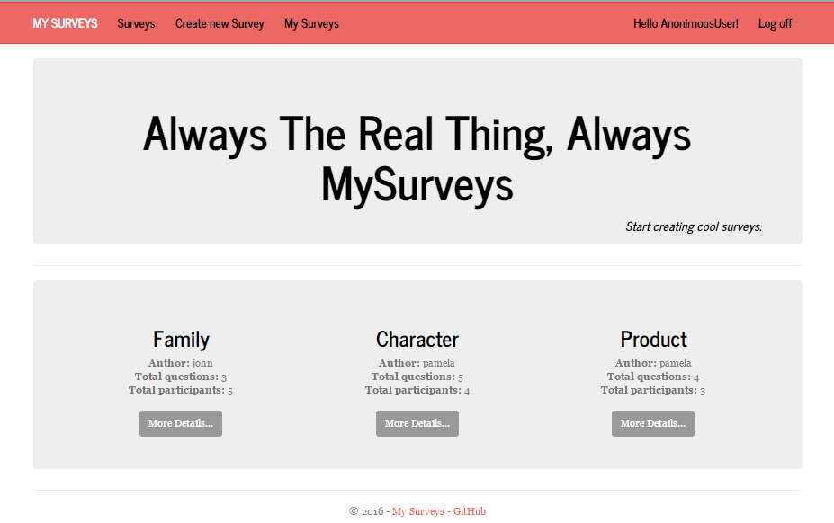
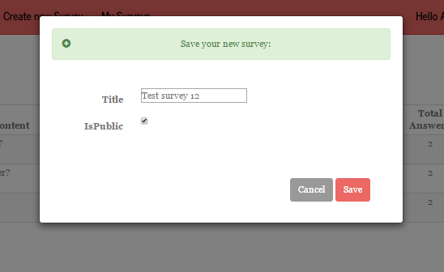
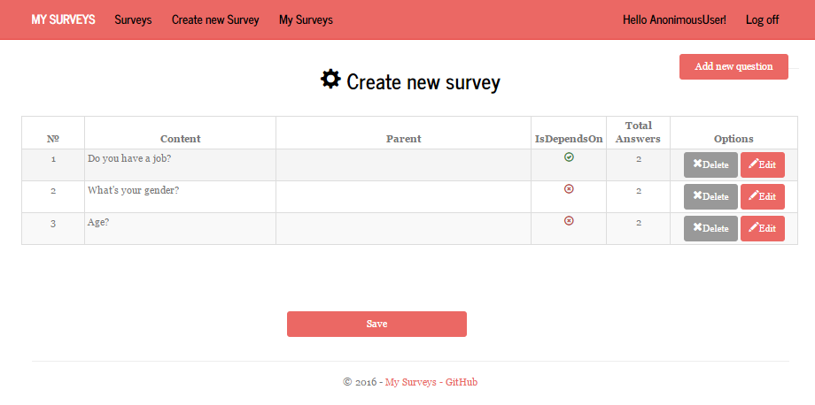
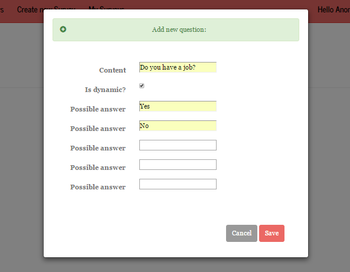
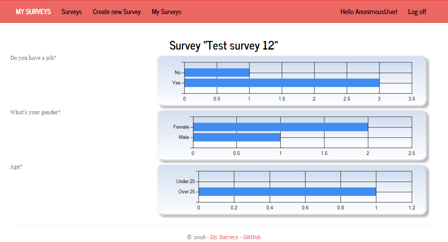
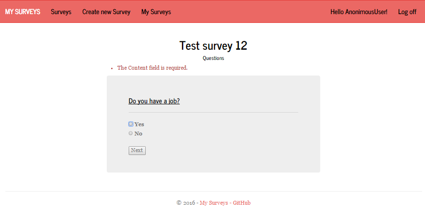

# MySurveys
### ASP.NET MVC Project

This document describes the **final project assignment** for the **ASP.NET MVC** course at Telerik Academy.

## Project Description

MySurveys is **ASP.NET MVC application** for creating dynamic surveys.

The application have:

* **Home page**
	* top 3 popular surveys
* **Public part** (accessible without authentication)
	* list of all public surveys
	* filling in only public surveys
* **private part** (available for registered users)
	* list of all surveys
	* filling in all surveys
	* profile
	* my surveys
	* create new survey
* **administrative part** (available for administrators only)
	* glimpse
	* elmah report 
	* create/edit/delete users
	* create/edit/delete responses
	* create/edit/delete surveys
	* create/edit/delete questions
	* create/edit/delete answers 

----------
* **Razor** template engine for generating the UI
* **MS SQL Server** as database back-end
* **Entity Framework 6** to access the database
* Used **repositories and service layer**
* **2 areas** for administration/surveys
* Used Kendo UI grid in administration
* Responsive UI with **Bootstrap**
* Used the standard **ASP.NET Identity System**
* Used **AJAX** - filling in survey, list all surveys(infinity scroll)
* Used **caching** on starting page(the most popular surveys)
* Used **Ninject** and **Automapper**
* Some **unit tests** for controllers, actions, routes, etc.
* **Error handling** and **data validation** to avoid crashes when invalid data is entered (both client-side and server-side)
* Prevent from **security** holes (XSS, XSRF, Parameter Tampering, etc.)

----------

## Instructions
**Home page - the most popular surveys are cached**

**After registering you will be able to create a new survey. You can choose whether to be public or visible only to other registered users.**

**When you add a new question will be able to choose whether next question will depend on his answers or not. You must specify this in EDIT menu.**

**You can edit/delete/check answers/ for all your surveys.**

**Filling a survey**

